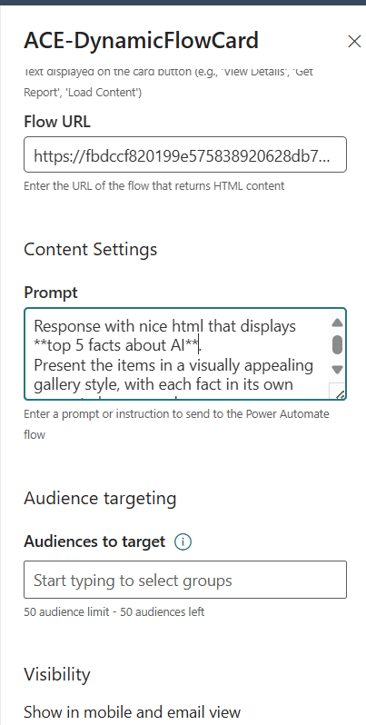
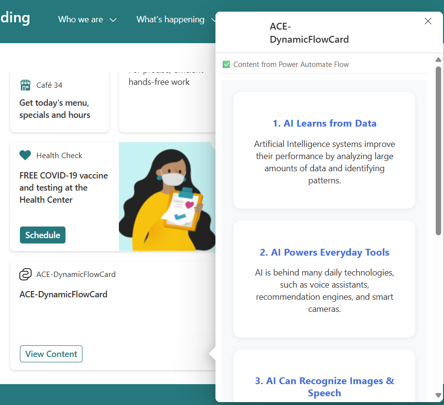

# ACE Dynamic Flow Card

## Summary

A SharePoint Framework (SPFx) Adaptive Card Extension (ACE) that integrates with Power Automate flows to display dynamic HTML content. This solution demonstrates how to securely call Power Automate flows from Viva Connections cards using authentication patterns with Bearer tokens.

The card allows users to configure a Power Automate flow URL and custom prompts through the property pane, then displays the HTML response from the flow in a QuickView. Perfect for creating dynamic content cards that can show personalized information, reports, or interactive content generated by AI & Power Automate.


## Screenshots

### ACE Card Configuration


*Configuration interface showing the property pane with settings for card title, button label, flow URL, and prompt configuration.*

### Dynamic Content Display



## Key Features

- ✅ **Secure Authentication**: Uses Bearer token approach with AadTokenProvider
- ✅ **Dynamic Content**: Displays HTML content returned from Power Automate flows
- ✅ **Configurable Prompts**: Allows users to configure custom prompts sent to flows
- ✅ **Error Handling**: Comprehensive error handling with fallback authentication methods
- ✅ **JWT Token Decoding**: Extracts tenant information for enhanced security
- ✅ **Real-time Loading States**: Visual feedback during flow execution
- ✅ **Responsive Design**: Works seamlessly in Viva Connections

## Used SharePoint Framework Version


## Applies to

- [SharePoint Framework](https://aka.ms/spfx)
- [Microsoft 365 tenant](https://docs.microsoft.com/en-us/sharepoint/dev/spfx/set-up-your-developer-tenant)
- [Viva Connections](https://docs.microsoft.com/en-us/viva/connections/)
- [Power Automate](https://docs.microsoft.com/en-us/power-automate/)

> Get your own free development tenant by subscribing to [Microsoft 365 developer program](http://aka.ms/o365devprogram)

## Prerequisites

- SharePoint Framework development environment
- Power Automate premium license (for authenticated flows)
- SharePoint Admin rights (for API permission approval)
- Node.js 18+ and npm

## Architecture

### Authentication Flow
```
ACE Card → AadTokenProvider → Bearer Token → Power Automate Flow → HTML Response → QuickView
```

### Data Flow
```json
{
  "userId": "user@domain.com",
  "userEmail": "user@domain.com", 
  "displayName": "User Name",
  "siteUrl": "https://tenant.sharepoint.com/sites/site",
  "timestamp": "2025-09-15T11:30:00.000Z",
  "requestId": "abc123def",
  "tenantId": "c3bdda97-e8dc-48ba-a1c0-a57673aa1dac",
  "prompt": "User-configured prompt text"
}
```

## Solution

| Solution               | Author(s)                                               |
| ---------------------- | ------------------------------------------------------- |
| ace-dynamic-flow-card  | [Meron Fridman - Principal Consultant - Microsoft ISD](https://www.microsoft.com/en-us/industry?activetab=pillars%3aprimaryr11?activetab=pillars%3aprimaryr11)          |

## Version History

| Version | Date             | Comments                                    |
| ------- | ---------------- | ------------------------------------------- |
| 1.0     | September 2025   | Initial release with Bearer token auth     |
| 0.9     | September 2025   | Added prompt configuration support          |
| 0.8     | September 2025   | Implemented PnP authentication pattern     |
| 0.5     | September 2025   | Basic ACE structure and Power Automate integration |

## Configuration

### 1. API Permissions Setup

Add the following to your `package-solution.json`:

```json
{
  "solution": {
    "webApiPermissionRequests": [
      {
        "resource": "Microsoft Flow Service",
        "scope": "User"
      }
    ]
  }
}
```

### 2. SharePoint Admin Approval

1. Deploy the solution to your SharePoint App Catalog
2. Go to SharePoint Admin Center
3. Navigate to **Advanced** → **API Access**
4. Approve the "Microsoft Flow Service" permission request

### 3. Power Automate Flow Setup

1. **Download the Flow Solution**:
   - Navigate to the `Flow/` folder in this repository
   - Download the `ACEContentFlow_1_0_0_1.zip` file

2. **Import to Power Automate**:
   - Go to [Power Automate](https://make.powerautomate.com)
   - Click **"Solutions"** in the left navigation
   - Click **"Import solution"**
   - Click **"Browse"** and select the `ACEContentFlow_1_0_0_1.zip` file
   - Click **"Next"** and review the solution contents
   - Configure any required connections if prompted
   - Click **"Import"** to complete the process

3. **Configure the Imported Flow**:
   - After import, go to **"Solutions"** → **"ACE Content Flow"** (or the imported solution name)
   - Click on the flow to open it
   - Click **"Edit"** to modify the flow
   - Review the **"When an HTTP request is received"** trigger
   - **Important**: Copy the HTTP POST URL from the trigger for your ACE configuration
   - Customize the response HTML content to match your requirements
   - Click **"Save"** and test the flow

### Flow Solution Details

The included flow solution (`ACEContentFlow_1_0_0_1.zip`) contains:

- ✅ **Pre-configured HTTP trigger** with proper JSON schema
- ✅ **Sample response template** with dynamic content
- ✅ **Error handling** for missing parameters
- ✅ **HTML formatting** optimized for ACE display
- ✅ **User context integration** (name, email, site info)
- ✅ **Prompt processing** for dynamic responses

### Expected JSON Schema

The flow is pre-configured to receive the following JSON payload from the ACE:

```json
{
    "type": "object",
    "properties": {
        "userId": {"type": "string"},
        "userEmail": {"type": "string"},
        "displayName": {"type": "string"},
        "siteUrl": {"type": "string"},
        "timestamp": {"type": "string"},
        "requestId": {"type": "string"},
        "tenantId": {"type": "string"},
        "prompt": {"type": "string"}
    }
}
```

### Customizing the Flow Response

After importing, you can customize the flow to:

- **Integrate with other services** (SharePoint lists, databases, APIs)
- **Add AI capabilities** (Azure OpenAI, AI Builder)
- **Connect to external systems** (CRM, ERP, third-party APIs)

### 4. ACE Card Configuration

1. Add the ACE to a Viva Connections dashboard
2. Click the gear icon to configure
3. **Basic Settings**:
   - **Card title**: Set the title displayed on the card
   - **Button label**: Customize the button text (e.g., "Get Report", "View Details", "Load Data")
   - **Flow URL**: Enter your Power Automate flow URL
4. **Content Settings**:
   - **Prompt**: Enter a prompt for your flow (optional)
5. Save the configuration

## Technical Implementation

### Key Files

- **QuickView.ts**: Main component with authentication and flow integration
- **AceDynamicFlowCardPropertyPane.ts**: Configuration interface
- **AceDynamicFlowCardAdaptiveCardExtension.ts**: Main ACE class and interfaces


### Common Issues

1. **403 Forbidden Error**: API permissions not approved in SharePoint Admin Center
2. **MisMatchingOAuthClaims**: Flow security settings don't match token claims
3. **Empty Response**: Flow doesn't have a Response action or returns non-HTML content
4. **Infinite Loading**: Check browser console for JavaScript errors

### Debug Information

The solution includes comprehensive logging. Check browser console for:
- 🔐 Authentication steps
- 📤 Request payload details
- 📥 Response information
- ❌ Error details with suggested solutions

## Security Considerations

- Bearer tokens are obtained dynamically and never stored
- No API keys or secrets are stored in the codebase
- Tenant ID is extracted from JWT for enhanced security
- Follows Microsoft security best practices for SPFx solutions

## Contributing

1. Fork the repository
2. Create a feature branch
3. Make your changes
4. Test thoroughly
5. Submit a pull request

## Disclaimer

**THIS CODE IS PROVIDED _AS IS_ WITHOUT WARRANTY OF ANY KIND, EITHER EXPRESS OR IMPLIED, INCLUDING ANY IMPLIED WARRANTIES OF FITNESS FOR A PARTICULAR PURPOSE, MERCHANTABILITY, OR NON-INFRINGEMENT.**

---

## Minimal Path to Awesome

1. **Clone this repository**
   ```bash
   git clone https://github.com/meronf/ACE-DynamicFlowCard.git
   cd ACE-DynamicFlowCard
   ```

2. **Install dependencies**
   ```bash
   npm install
   ```

3. **Build and serve locally**
   ```bash
   gulp build
   gulp serve
   ```

4. **Test in SharePoint Workbench**
   - Open SharePoint Workbench in your tenant
   - Add the ACE to test locally

5. **Deploy to production**
   ```bash
   gulp build --ship
   gulp bundle --ship
   gulp package-solution --ship
   ```

6. **Upload to App Catalog and approve API permissions**

## Useful Resources

- [PnP Power Automate Integration Article](https://pnp.github.io/blog/post/using-power-automate-flow-api-in-your-spfx-solution/)
- [SPFx ACE Documentation](https://docs.microsoft.com/en-us/sharepoint/dev/spfx/viva/overview-viva-connections)
- [Power Automate HTTP Triggers](https://docs.microsoft.com/en-us/power-automate/triggers-introduction)
- [SharePoint Framework Authentication](https://docs.microsoft.com/en-us/sharepoint/dev/spfx/use-aadhttpclient)

## License

This project is licensed under the MIT License - see the [LICENSE](LICENSE) file for details.
